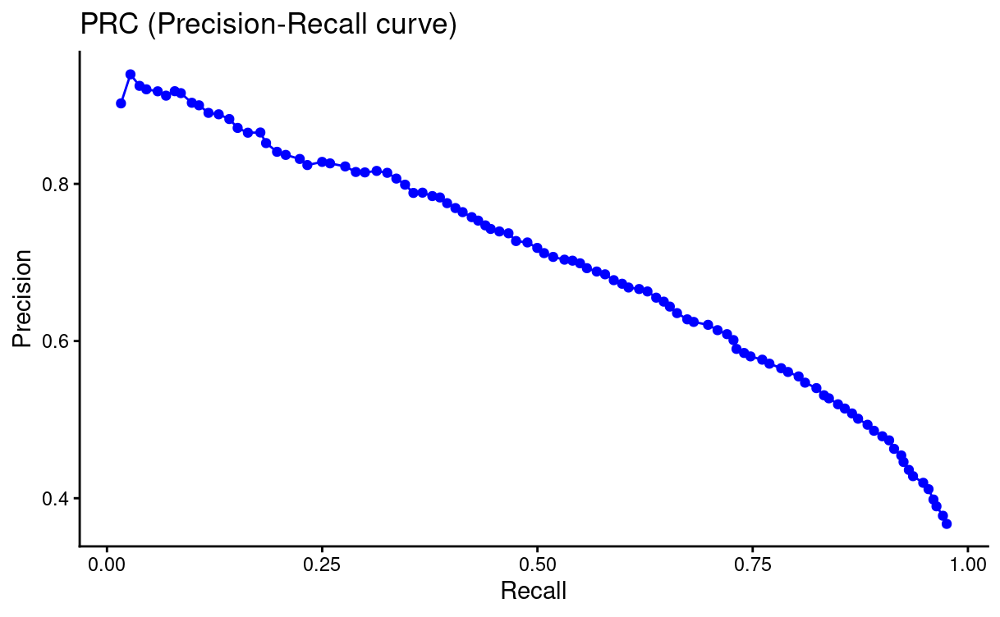
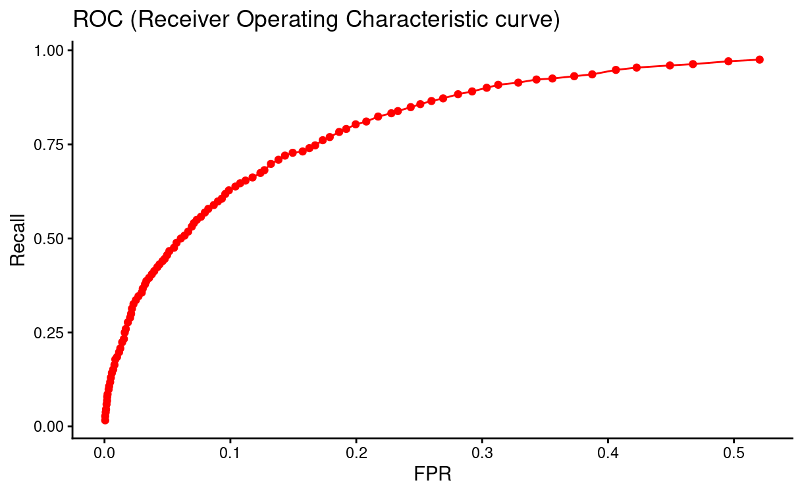

# m6APrediction

Last Updated:November 11th, 2025

Author: Yuxiang Jia

Email: jia.yuxiang\@outlook.com

=========================================

## Synopsis

**m6APrediction** is an R package that provides prediction functions for identifying m6A (N6-methyladenosine) modification sites as “Positive” or “Negative” using a **Random Forest–based machine learning** approach.

m6A is one of the most abundant internal modifications on eukaryotic mRNA and plays essential roles in RNA metabolism, cell development, differentiation, and tumorigenesis. This package aims to make m6A site prediction simple, accessible, and reproducible for researchers working in bioinformatics and RNA biology.

## **Main Functions in m6APrediction:**

The **m6APrediction** package provides three core functions designed to streamline the prediction of m6A RNA modification status using Random Forest models and engineered sequence-derived features.

1.  **dna_encoding()**

    **Purpose:**

    Convert DNA *k-mer* strings (e.g., "ATACT") into a structured data frame suitable for downstream machine-learning prediction.

    **Key Features:**

    Parses DNA or RNA 5-mers

    Extracts physicochemical and contextual sequence properties

    Produces a model-ready feature set

    Automatically validates input format

    Returns a tibble or data frame

    **Example Use:**

    ```{r}
    dna_features <- dna_encoding("ATACT")
    ```

2.  **prediction_single()**

    **Purpose:**

    Predict the m6A modification status for **one** RNA site using a trained Random Forest model and individual feature values.

    **Key Features:**

    Accepts explicit feature values (gc_content, RNA_type, exon_length, etc.)

    Internally formats and encodes the input

    Ensures compatibility with the training model

    Returns predicted probability and predicted class **Example Use:**

    ```{r}
    prediction_single(
      ml_fit = rf_model,
      gc_content = 0.45,
      RNA_type = "mRNA",
      RNA_region = "exon",
      exon_length = 145,
      distance_to_junction = 32,
      evolutionary_conservation = 0.67,
      DNA_5mer = "ATACT"
    )
    ```

    **3. prediction_multiple()**

    **Purpose:**

    Predict m6A modification status for **multiple** sites simultaneously using a feature data frame.

    **Key Features:**

    Accepts an input data frame containing all required features

    Performs consistency checks

    Vectorised prediction over multiple rows

    Returns a data frame with predicted probabilities

    **Example Use:**

    ```{r}
    results <- prediction_multiple(
      ml_fit = rf_model,
      data_df = test_df
    )
    head(results)
    ```

    ## **Evaluation of Random Forest Model:**

    

## Install:

To install m6APrediction from Github, copy-and-paste the following code inside the **R console**:

``` r
# Install from GitHub
remotes::install_github("flatline515/m6APrediction")
```

## Load Example Data:

you can also load default random forest model (rf_model) and example data (example_df) using the code below:

```{r}
# Example: Load bundled example model
rf_model <- readRDS(system.file("extdata", "rf_fit.rds",
                                package = "m6APrediction"))
# Load example feature dataframe
example_df <- read.csv(
  system.file("extdata", "m6A_input_example.csv", package = "m6APrediction")
)
```
